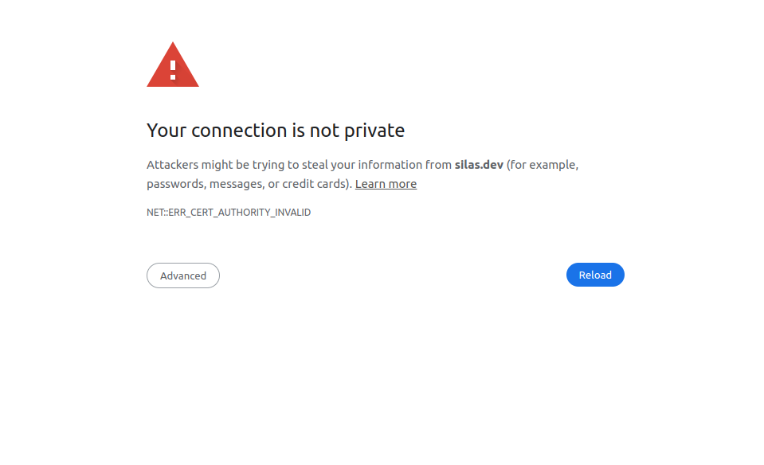

Last Edit: 20240527
# Project Setup
The setup has been modified so that the component parts of the system are now structured as Kubernetes deployments that can then be easily deployed onto a cloud provider like AWS/Google Cloud or any other.

To run the setup in your local machine you'll need the following tooling:
- Minikube: https://minikube.sigs.k8s.io/docs/
  - You can find instructions on how to install minikube for your setup in the doc section. Once minikube is installed, run `minikube start`. For access to the minikube dashboard, from which you can monitor the state of the setup, in a separate terminal window, run `minikube dashboard`. This will bring up the kubernetes monitoring dashboard. 
- Skaffold: https://skaffold.dev/
  - Skaffold triggers pod redeployment as changes are made in the folder in which we are working on. 

Start by installing these tools onto your system. 
After installing these tools and having started minikube run the command: minikube addons enable ingress
Once these are installed, you can deploy the entire setup, by running `skaffold dev` in the root folder. What this commmand does is deploy the current setup onto your kubernetes cluster being run by minikube.

## Platform breakdown
Whereas all the parts of the application were previously separated into backend, frontend and database, the backend has been split into more modular sections that will allow us to work on different parts of the application, without concerns that we are introducing bugs to different parts of the applciation. The backend is now decomposed into the following folders:
- backend: contains the functionality related to file uploads for the purposes of submission handling and report summarization. This is still a work in progress
- bot-service: responsible for the current chatbot.
- data-service: responsible for providing the data that is presented in the dashboard. Provides the API endpoints that fetch data from the database service
The frontend and database folders don't have any changes from the previous deployments. 

## Backend Components Setup
Each of the previously described services have a Dockerfile which is used to build the image that Kubernetes then runs in the cluster. These docker images are stored at dockerhub. We will be creating a Silas dockerhub, for storing these images, as we are currently using my own account. Even though the images are public, it makes sense that we all have access to the repository. 
In the manifest file that kubernetes uses to provision the services, we provide the docker image that should be used to create the service. If we need to update the docker image, we make the changes locally, and push the change to dockerhub. Upon update, skaffold reprovisions the machines in the local environment. 
The manifests that kubernetes uses to setup the machines are stored in the `infra/k8s` folder. Each service has a dedicated manifest, which specifies a deployment and a service definition. The folder also contains an ingress service definition, which is used to define how requests made to the application are to be handled and routed to the various application endpoints. 

## Accessing the application locally
To access the dashboard, once kubernetes stabilizes the deployment, you can access `silas.dev` in your browser. There's nothing special to this address. It is a nicer way to navigate to the environment, rather than typing the minikube ip address, from which the application is being served. 
When you setup your environment, you'll need to add an entry in your `/etc/hosts` file, mapping minikube's ip, to `silas.dev`. 
This can be done by adding this line:
`192.168.49.2    silas.dev`
You'll need admin permissions to modify the file, meaning that you'd use `sudo` or you'd open the file with admin privileges for editing. Note that the address `192.168.49.2` is minikube's ip address in my machine. Please double check minikube's IP address in your machine by running:
`minikube ip` 
and use that value when modifying your `/etc/hosts` file.

It is recommended that you use Google Chrome to access the dashboard. This is because at the moment we are not using secure certificates, which cause the browsers to refuse to connect to the application. You'll see a warning about trying to connect:

To get around this, in Google Chrome, click on the page and type `thisisunsafe`, and the browser will then present the page. This is temporary and will be resolved, once we introduce signed certificates to the application.

## Next Steps
This is an ongoing process and the next steps are:
- Isolate the logic for generating the data for the map in the dashboard: Following a similar approach, in which the data will no longer be served from a static file in the user system, but be provided by a database connection, using something like PostGIS.
- Making the database storage persistent: at the moment, the database is recreated whenever the cluster is spun up, meaning that data saved to the database is not persisted between restarts. 
- Changing how file processing for document analysis and submissions is handled. Previously the files we're stored in the local machine, but these will be stored in a volume attached to the kubernetes machine running the backend. Once in production, the files will be stored in S3, or a similar solution. I'm considering Minio as a solution for this as well.
- Adding an authorization layer to secure access to the dashboard as well as securing the API endpoints. Currently considering https://www.authelia.com/ and https://www.keycloak.org/, though there are other options. 

## App Port Mappings
- Frontend: 8080
- Backend: 8000
- Data Service: 8001  
- Submissions Service: 8002
- File Handling Service: 8003
- Bot Service: 8005


## More Stuff
### Kubernetes Checks
During the process of development, it is good practice to ensure that all the moving bits in the system are vetted, meaning that they aren't open to security issues, that may compromise the entire system. As we keep developing the system, we'll be introducing tools to help us monitor this process. One of these tools is [Kube Score](https://kube-score.com/)
This is a static analysis tool that checks for flaws in the kubernetes definition files, in order that these are mitigated. This tool will eventually be integrated into a CI/CD process.
To execute it, after you install it on your system run:
```
kube-score path/to/kubernetes/file
```
In our case this would be infra/k8s.


### PostGres deployment as a stateful set
To guarantee availability and failover on the installed PG database, this has to be configured to use a stateful set.

### PostGIS Configuration
PostGIS is a Postgres distribution that contains plugins to help manage geospatial information. To install PostGIS in Kubernetes, it is necessary to install the CNPG operator in the cluster. 
Ensure that minikube is running and paste this command in a console:
```
kubectl apply --server-side -f \
  https://raw.githubusercontent.com/cloudnative-pg/cloudnative-pg/release-1.23/releases/cnpg-1.23.1.yaml

```

Documentation as to what the command does and why it's needed can be found [here](https://cloudnative-pg.io/documentation/current/installation_upgrade/)
For installation and config of postgis, run the file in pgs_config. This manifest creates a 3 node PostgreSQL 14 cluster, with a primary and two replicas, each with 10Gi for PGDATA, 2Gi reserved for WALs, and PostGIS 3.2 installed in the main application database alongside a few more extensions.
Note that at the time of this writing (20240527), the deployment hasn't been configured to support secrets, and other best practices. The manifest and deployment process will be updated, as this process evolves.

To apply the configuration, when you run the manifest, make sure that it is applied onto the **postgis** namespace. If you haven't created it yeat, you can do so as follows:

```
kubectl create namespace postgis
```

you can then apply the manifest thusly:
```
kubectl apply -f pgis_config/pgis_config.yaml -n postgis
```

It is necessary to add a couple of steps to enable access to the database from outside the cluster, i.e, for connecting with a client for instance. While this may be useful in development, chances are that this access will be restricted or even non-existent when moved to production.
In any case it is necessary to apply this patch to the nginx controller in the cluster:
```
kubectl patch deployment ingress-nginx-controller --patch "$(cat patch.yaml)" -n ingress-nginx
```
Ensure that this is pointed at the **patch.yaml** file that exists in the **pgis_config** folder. Additional consideration will be taken to ensure that this config does not clash with the previously existing configuration of the ingress, to allow the webapp to function as expected.

#### PG considerations
Despite having deployed a stateful set, we will be using cnpg deployment of postgres, both for the application and the PostGIS use cases. This means that there'll be two clusters for both cases.